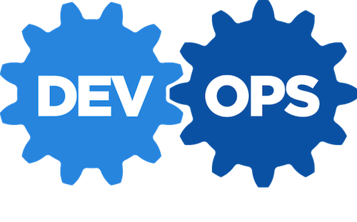
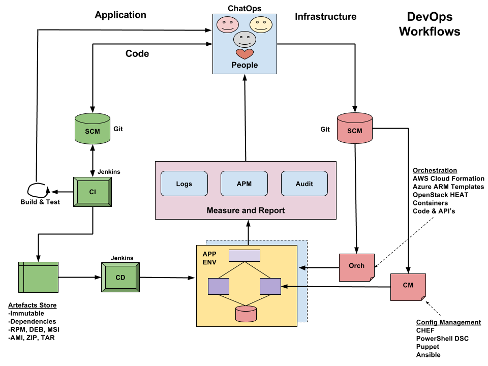
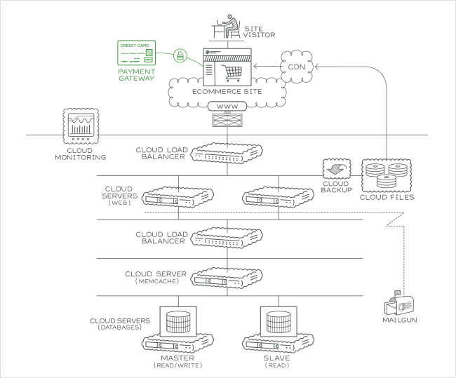

.. _solution_design:

.. header::

    Customer XYZ Cloud Solution Design

    Version 1.0

.. footer::

    Page ###Page### of ###Total###

.. image:: ../images/rs-logo-1.png
   :align: right

Solution Design
===============

Overview
--------

This project has the following high-level goals:

#. Build repeatable cloud envinronments from code - IaaC
#. Configure Web and Application servers via Automation
#. Application Delivery is Consistent and Automated
#. Scale the application during high load

Key Deliverables
~~~~~~~~~~~~~~~~

In order to acheive these goals, Rackspace will:

1. Create templates for a complete application Environments
#. Setup Configuration Management using CHEF Automation
#. Setup Jenkins CI/CD server to test and deliver application code
#. Provide 'Best Practices' guide for writing automation
#. Ensure all code and scripts are stored in a SCM system
#. Provide a 'Troubleshooting' guide and full project documentation

Key Components
~~~~~~~~~~~~~~

1. Rackspace Public Cloud
#. Rackspace DBaaS - MySQL
#. CHEF Automation
#. CentOS 7
#. Jenkins CI Server
#. GitHub

Why DevOps?
-----------

*Q. What is the value to my business when using DevOps?*

**A. There are many benefits, such as:**
  * consistancy
  * agility
  * scale 
  * security
  * quality

|

DevOps Workflow
---------------

The diagram below shows some of the components in a that can be delivered in a Rackspace Professional Services DevOps solution.

Cloud Infrastructure
--------------------

The diagram below shows the basic components of the Cloud Infrastructure.

Server Consistency
~~~~~~~~~~~~~~~~~~

The aim of the automation is to ensure the servers are in a consistent state.

Automation does this by applying a set of configuration items to the target servers and checking this state at regular intervals to ensure the server is compliant. 

The Automation will ensure that:

- All Web servers have exactly the same OS packages installed
- All Application servers have exactly the same OS packages installed
- Users and their permissions are the same across all servers
- TimeZone is set to UTC on all servers
- Firewall rules are consistent on all Web Servers

Rackspace Cloud Servers
~~~~~~~~~~~~~~~~~~~~~~~

The Cloud servers image used will be:

  - CentOS 7

This image will be based on a vanilla build of CentOS 7 with the following addtional changes:

Provisioning Process
++++++++++++++++++++

1. Log in to the server
#. Run script to register servers

.. note::

    The registration script is only run once from the client servers and is a manual step in the process.

Server Roles
------------

The servers are broken down into two roles for the Automation.

Each of these Roles will have specific configuration applied to them as part of the automation.

Below is a high level overview of each Role type.

**Web Server Role**

- Web Server - NGINX, Varnish, Squid Proxy

**Application Server Role**

- Application Software - PHP 5.6, Java 7
- Other Software - MySQL Client, Redis Client

Common Configuration
~~~~~~~~~~~~~~~~~~~~

There are some area's of the server Automation that are common on both types of servers:

- TimeZone - UTC
- Admin Users
- Registry Settings

Automation
----------

Based on the servers role it will have the correct configuration applied to it.

Automation Service Configuration
~~~~~~~~~~~~~~~~~~~~~~~~~~~~~~~~

Configuration
+++++++++++++

Node Configurations
+++++++++++++++++++

Nodes
+++++

- The registered servers that will use the Automation
- The Server compliance status
- The configuration file applied to each server

RACI
----

The follow matrix shows who is Responsible, Accountable, Consulted, and Informed in relation to the System.

*Content pending*

Project Resources
-----------------

Automation Source Code
~~~~~~~~~~~~~~~~~~~~~~

Project source code and automation assets.

Documentation
~~~~~~~~~~~~~

The canonical documentation resources, including source code.

* Built using Sphinx with ReStructuredText
* GitHub URL: https://github.com/

Troubleshooting
---------------

*Content pending*

